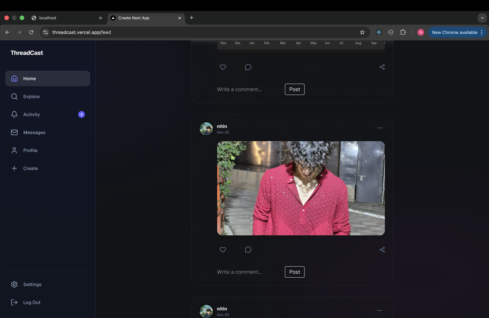
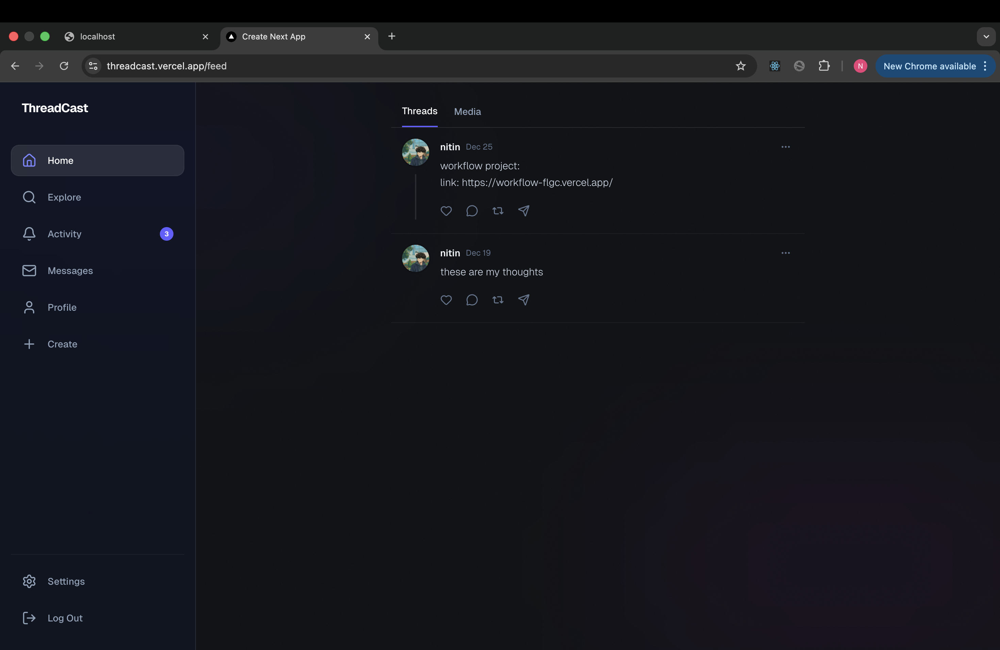
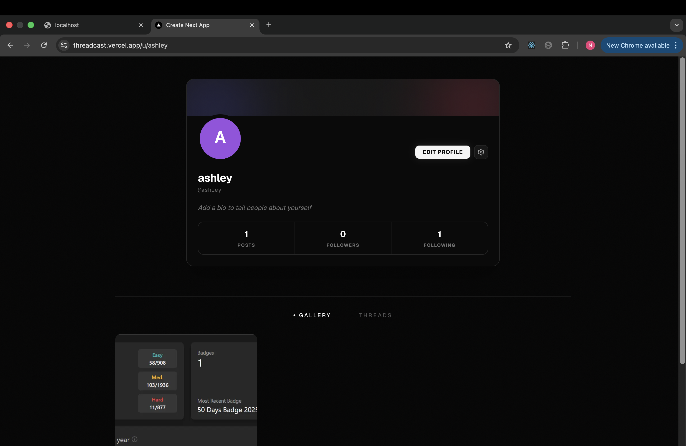

# 🚀 ThreadCast

ThreadCast is a modern full-stack social platform built with **scalable architecture, clean data modeling, and real-time communication** at its core.

The project prioritizes **backend correctness first**, followed by **server-driven UI patterns** and **real-time features**, making it production-ready and easy to extend.

---

## 🧱 Tech Stack

### Frontend
- Next.js (App Router)
- React + TypeScript
- Tailwind CSS
- Server Components & Client Components
- Zod (schema validation)

### Backend
- NextAuth (Credentials + OAuth)
- Prisma ORM
- PostgreSQL
- JWT-based session strategy

### Realtime
- WebRTC (peer-to-peer audio/video)
- WebSocket-based signaling
- ICE candidate handling (STUN/TURN ready)

---

## 📸 Screenshots

> Images are stored in `/public`

### Authentication


### Feed


### Profile


### Realtime Call


---

## 📦 Implemented Features

---

## ✅ Phase 1 — Authentication & Profiles

### Authentication
- Email + password registration
- Credentials-based login
- Google OAuth (optional)
- Secure password hashing using `bcrypt`
- JWT-based sessions via NextAuth

### User Profiles & Onboarding
- First-time onboarding flow
- Profile fetch & update APIs
- Avatar upload support
- Onboarding enforcement for incomplete profiles

**Profile Fields**
- `email`
- `username`
- `bio`
- `avatarUrl`
- `onboarded`

**API Endpoints**
```http
GET   /api/me      → Fetch current user
PATCH /api/me      → Update profile