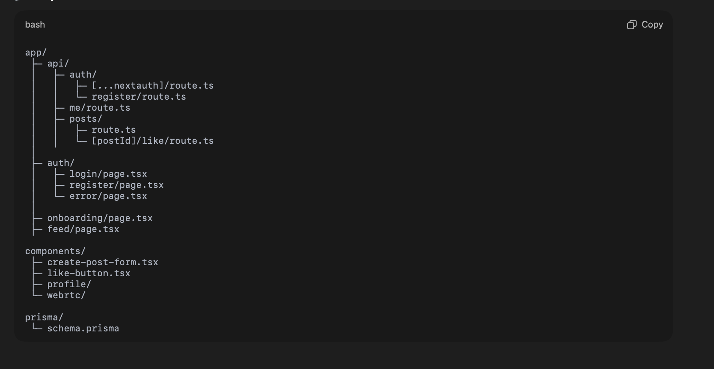

# 🚀 ThreadCast

ThreadCast is a modern, full-stack social media platform built with **Next.js App Router**, focusing on **correct data modeling, scalable APIs, server-driven UI, and real-time communication**.

The project is designed to mirror real-world production systems by prioritizing backend correctness, clean architecture, and extensibility before adding features.

---

## ✨ Features

### 👤 Authentication & Profiles
- Email + password authentication
- Credentials-based login
- Google OAuth support
- JWT-based session strategy
- Secure password hashing using bcrypt
- First-time onboarding flow
- Profile creation & updates
- Avatar upload support

### 🧵 Posts & Feed
- Create text-based posts
- Server-rendered feed
- Latest-first ordering
- Author metadata included
- Optimistic UI updates using `router.refresh()`

### ❤️ Likes System
- Like / unlike posts
- Unique user-post constraint
- Real-time like count updates
- Safe handling of duplicate likes

### 🎥 Realtime (WebRTC)
- 1-to-1 audio/video calls
- Peer-to-peer media streaming
- WebSocket-based signaling
- ICE candidate handling
- Graceful call lifecycle management

### 🔒 Security & Architecture
- Server-side session validation
- Protected routes
- Zod-validated API inputs
- Clean Prisma schema design
- Server Components where possible

---

## 🧱 Tech Stack

### Frontend
- Next.js (App Router)
- React + TypeScript
- Tailwind CSS
- Server Components & Client Components
- Zod (schema validation)

### Backend
- NextAuth (Credentials + OAuth)
- Prisma ORM
- PostgreSQL
- JWT-based sessions

### Realtime
- WebRTC
- WebSockets (signaling)
- STUN/TURN-ready architecture

---

## 📸 Screenshots

> Images are stored in `/public`

### Feed


### Profile


---

## 📦 Implemented Features by Phase

---

## ✅ Phase 1 — Authentication & Profiles

### 🔐 Authentication
- Email + password registration
- Credentials-based login
- Google OAuth (optional)
- Secure password hashing with bcrypt
- JWT session strategy via NextAuth

### 👤 User Profiles & Onboarding
- First-time onboarding enforcement
- Profile fetch & update APIs
- Avatar upload support

**Profile Fields**
- `email`
- `username`
- `bio`
- `avatarUrl`
- `onboarded`

### 🔌 API Endpoints
```http
GET   /api/me      → Fetch current user profile
PATCH /api/me      → Update profile data


Protected Routes
	•	Server-side session validation
	•	Redirects for unauthenticated users
	•	Onboarding enforcement

Tested (Postman)
	•	Registration
	•	Login
	•	Session persistence
	•	Profile updates


	🎨 Frontend Routes (Phase 1)
	•	/auth/login
	•	/auth/register
	•	/auth/error
	•	/onboarding


✅ Phase 2 — Posts & Likes

Posts System
	•	User → Post (1-to-many)
	•	Clean, extensible Prisma schema
API

POST /api/posts   → Create post
GET  /api/posts   → Fetch feed


Feed response includes:
	•	Author details
	•	Like count
	•	Whether the current user liked the post

Feed UI (/feed)
	•	Server Component rendered
	•	Displays content, author, timestamp
	•	Like toggle with optimistic UX
	•	Uses router.refresh() (no client state hacks)

Likes System
	•	Dedicated Like model
	•	Unique constraint: (userId, postId)


API
POST   /api/posts/[postId]/like
DELETE /api/posts/[postId]/like
	•	Idempotent
	•	Safe handling of duplicate likes


	✅ Phase 3 — Realtime (WebRTC)

WebRTC Calling
	•	1-to-1 audio/video calls
	•	Peer-to-peer media streaming
	•	WebSocket-based signaling
	•	Offer / Answer exchange
	•	ICE candidate queueing
	•	Graceful disconnect handling

Architecture Highlights
	•	RTCPeerConnection
	•	Media stream lifecycle management
	•	Scalable signaling design

### Architecture


🏁 Current Status
	•	✔ Authentication & Sessions
	•	✔ Profiles & Onboarding
	•	✔ Posts, Feed & Likes
	•	✔ WebRTC Realtime Calls
	•	✔ Scalable, production-ready architecture.


